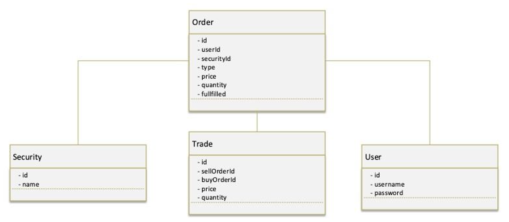
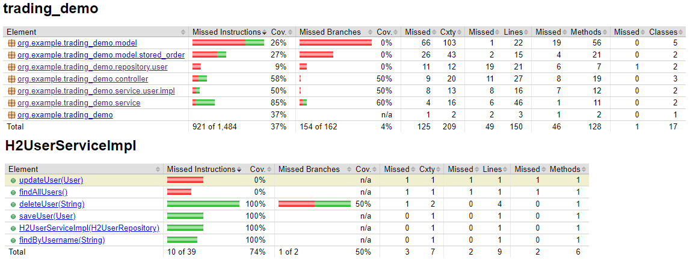
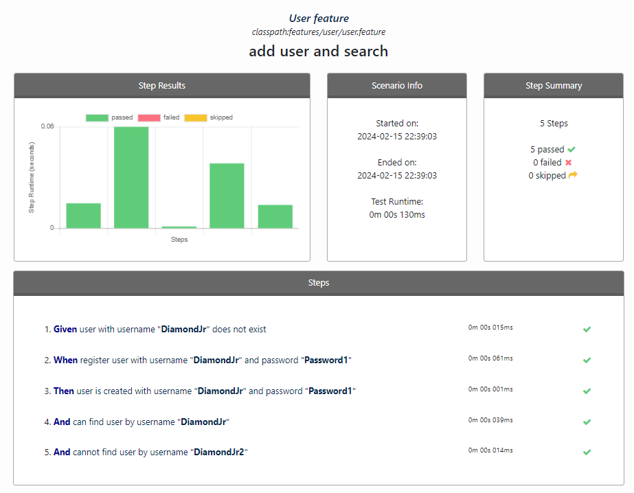
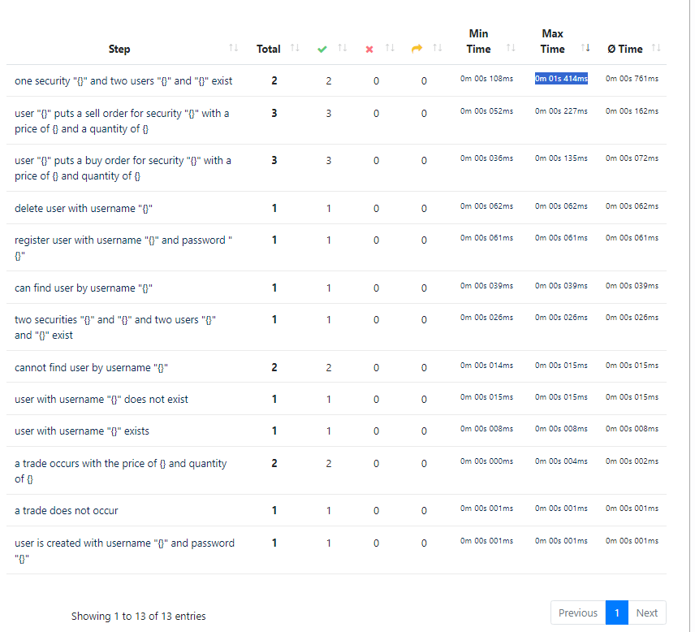
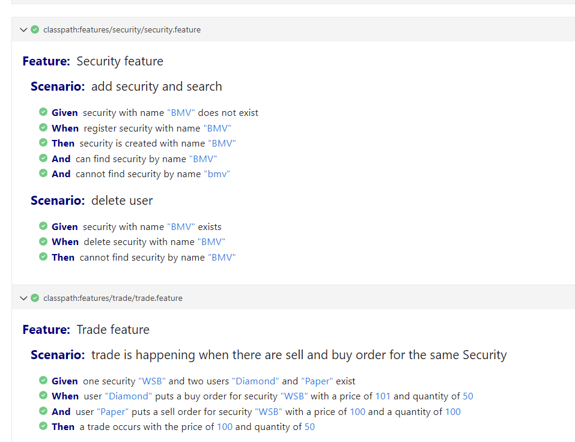
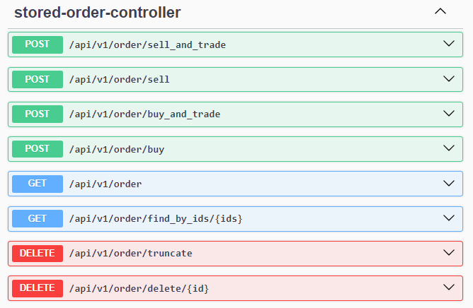

# Trading Demo REST API

Welcome to the Trading Demo REST API! This application provides a RESTful API for managing users, securities, orders, and trades. It is built using Spring Boot framework.

## Features

* 🏗️ **Models**: User, Security, Order, Trade.
* 🛠️ **Database**: H2 in-memory database. Access the H2 console at <http://localhost:8080/h2-ui>.
* 🥒 **Testing**: Cucumber BDD test coverage.
* 📊 **Reports**: Jacoco coverage report, Cluecumber report, and Cucumber HTML report.
* 🚀 **API**: Access Swagger UI at <http://localhost:8080/swagger-ui/index.html> for testing requests and API specs.
* 🐳 **Containerization**: `docker compose up` available.

See `/src` folder structure in [this document](doc/src_tree.md).

## System Overview

* **Functionality**: Trade Operations
* **Primary Objective**: Providing users with the ability to execute trade operations with securities.
* **Scenario**: Trades occur when there are both sell and buy orders for the same security.

### Scenario Steps

* **Precondition**: There is one security labeled "_WSB_" and two users named "_Diamond_" and "_Paper_" exist in the system.
* **Action Step**: User "_Diamond_" places a buy order for security "_WSB_" at a price of **101** and a quantity of **50**.
* **Action Step**: User "_Paper_" places a sell order for security "_WSB_" at a price of **100** and a quantity of **100**.
* **Result Verification**: A trade occurs with a price of **100** and a quantity of **50**.
* **Expected Outcome**: After the scenario execution, a successful trade operation will have taken place between users "_Diamond_" and "_Paper_" in the securities market. The trade price will be **100**, and the quantity traded will be **50** units.

## DB Schema overview



DB Schema is defined in `src/main/resources/schema.sql`, and DB is preloaded with data from `src/main/resources/data.sql`.

**Models** are User, Security, Order, Trade.

* **Security**: Securities are represented as tradable entities, such as stocks, within the system.
* **User**: Users have the ability to place orders for buying or selling securities.
* **Order**: Orders are entities containing attributes such as ID, user, security, type, price, quantity, and fulfillment status. These orders represent intentions to buy or sell securities within the system.
* **Trade**: Trades are entities that are created when two or more orders are matched, resulting in an actual transaction taking place within the system.

## Getting Started

To run the REST API server locally, you can use Maven or Docker:

### Run REST API Server

```sh
# Using Maven
mvn spring-boot:run

# Using Maven
mvn clean package
java -jar ./target/trading_demo-0.0.1-SNAPSHOT.jar

# Using Maven wrapper
./mvnw clean spring-boot:run

# Using Docker
docker compose build
docker compose up
```

After starting the server, you can access the API endpoints at http://localhost:8080/api/v1.  
Read user list for API checking: `curl http://127.0.0.1:8080/api/v1/users` 

## Run BDD test

```sh
# Run tests via Maven
mvn test

# Or using Maven wrapper
./mvnw test
```

### Test with reports

```sh
# Run tests with reports
mvn verify

# Or using Maven wrapper
./mvnw verify

# Via docker
docker build -t trading_demo_bdd_test -f ./Dockerfile.runtest .
docker run trading_demo_bdd_test
# Enter docker container
docker run -it trading_demo_bdd_test bash
```

#### Observe HTML reports

* `target/site/jacoco/index.html` Jacoco coverage report



* `target/generated-report/index.html` Cluecumber report




* `target/cucumber-report/cucumber.html`



## Documentation

Access API documentation in running app by <http://localhost:8080/swagger-ui/index.html>.
It is produced by [springdoc-openapi](https://springdoc.org/)



## Manual requests

### Orders

#### Buy order

POST: `http://localhost:8080/api/v1/order/buy`

#### Buy order and trade

POST: `http://localhost:8080/api/v1/order/buy_and_trade`

Payload example (`CustomerOrder` object):

```json
{
  "price": 100,
  "quantity": 80,
  "securityName": "Apple",
  "userName": "user4"
}
```

#### Sell order

POST: `http://localhost:8080/api/v1/order/sell`

#### Sell order and trade

POST: `http://localhost:8080/api/v1/order/sell_and_trade`

Payload example:

```json
{
  "price": 150,
  "quantity": 40,
  "securityName": "Apple",
  "userName": "user3"
}
```

Request example:

```sh
curl -X 'POST' \
  'http://localhost:8080/api/v1/order/sell_and_trade' \
  -H 'accept: */*' \
  -H 'Content-Type: application/json' \
  -d '{
  "price": 150,
  "quantity": 40,
  "securityName": "Apple",
  "userName": "user3"
}'
```

Response example (`Trade` object):

```json
{
  "id": 1,
  "price": 100,
  "quantity": 40,
  "sellOrder": {
    "id": 3,
    "price": 150,
    "quantity": 40,
    "type": "SELLER",
    "fulfilled": true,
    "user": {
      "id": 3,
      "username": "user3",
      "password": "password3"
    },
    "security": {
      "id": 1,
      "name": "Apple"
    }
  },
  "buyOrder": {
    "id": 1,
    "price": 100,
    "quantity": 50,
    "type": "BUYER",
    "fulfilled": true,
    "user": {
      "id": 1,
      "username": "user1",
      "password": "password1"
    },
    "security": {
      "id": 1,
      "name": "Apple"
    }
  }
}
```

#### List orders

GET: `http://localhost:8080/api/v1/order`
 
#### Find orders by ids

GET: `http://localhost:8080/api/v1/order/find_by_ids/{order_id1},{order_id2},...`

#### Delete order by id

DELETE: `http://localhost:8080/api/v1/order/delete/{order_id}` 

#### Drop all orders

DELETE: `http://localhost:8080/api/v1/order/truncate`

### Users

#### List users

GET: `http://localhost:8080/api/v1/users`

Request example:

```sh
curl -X GET http://localhost:8080/api/v1/users
```

#### Add user

POST: `http://localhost:8080/api/v1/users/save`

Payload example:

```json
{
    "username": "user5",
    "password": "pw5"
}
```

Request example:

```sh
curl -X 'POST' \
  'http://localhost:8080/api/v1/users/save' \
  -H 'accept: */*' \
  -H 'Content-Type: application/json' \
  -d '{
  "username": "user5",
  "password": "pw5"
}'
```

Response example:

Status Code: `200`

Response Body:

```json	
{
  "id": 5,
  "username": "user55",
  "password": "password55"
}
```

Response Headers:

```shell
connection: keep-alive 
content-type: application/json 
date: Sun,18 Feb 2024 16:42:16 GMT 
keep-alive: timeout=60 
transfer-encoding: chunked
```

#### Update user

PUT: `http://localhost:8080/api/v1/users/update`  

Payload example:

```json
{
  "id": 5,
  "username": "user55",
  "password": "password55"
}
```

Request example:

```sh
curl -X 'PUT' \
  'http://localhost:8080/api/v1/users/update' \
  -H 'accept: */*' \
  -H 'Content-Type: application/json' \
  -d '{
  "id": 5,
  "username": "user55",
  "password": "password55"
}'
```

#### Delete user

DELETE: `http://localhost:8080/api/v1/users/delete/{username}`

```sh
curl -X 'DELETE' 'http://localhost:8080/api/v1/users/delete/user3'
```

### Securities

#### List securities

GET: `http://localhost:8080/api/v1/security`

#### Find by name

GET: `http://localhost:8080/api/v1/security/{security_name}`
 
#### Add security

POST: `http://localhost:8080/api/v1/security/save`

```json
{
    "name": "sec-name"
}
```

#### Delete security

DELETE: `http://localhost:8080/api/v1/security/delete/{security_name}`

## Links

* [Github: Cluecumber](https://github.com/trivago/cluecumber/)
* [JaCoCo: Documentation](https://www.jacoco.org/jacoco/trunk/doc/)

## Contributing

We welcome contributions, and if you're interested, have a look at the [CONTRIBUTING](CONTRIBUTING.md) document.

## License

The scripts and documentation in this project are released under the [MIT License](LICENSE).
